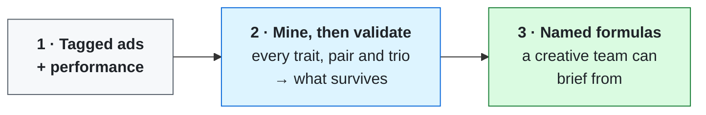

# Creative Pattern Analysis

**Find which creative choices actually beat your portfolio — and check whether each finding is real.**



Group ads by what they have in common, report the best groups, and you will always find something. With 33 traits you are testing tens of thousands of combinations, and thousands look good by luck alone.

On a real portfolio: **44,587 patterns tested, 201 survived.** Roughly 2,200 would clear p<0.05 by chance — so 201 is *fewer* than luck produces, which tells you most of the search space is genuinely null.

The mining and the judging are deliberately separate. A miner that adjudicates its own output will always find something.

---

## Run it

1. Pick the skill you need from the table below.
2. Put its `SKILL.md` in your AI tool's instructions field — Claude Project, Custom GPT, Gemini Gem, or an API system prompt.
3. Put anything in its `reference/` folder, and anything in this repo's `reference/`, into the knowledge base.

Missing a required input, they ask instead of guessing.

---

## What's in here

| Skill | Does |
|---|---|
| [`creative-pattern-miner`](./skills/creative-pattern-miner) | Searches every trait, pair and trio. Emits candidates and the search size behind them |
| [`creative-pattern-validator`](./skills/creative-pattern-validator) | Decides which survive — chance, clustering, generalization, actionability |
| [`winning-ad-formula-finder`](./skills/winning-ad-formula-finder) | Turns surviving combinations into named formulas with a brief |

They chain, but each one runs on its own.

---

## How it works

1. The miner drops ads below the volume floor, enumerates the search space, and reports how many patterns it tested
2. The validator tests per ad rather than per impression, corrects for the search size, and shuffles labels at campaign level to check a finding isn't really one campaign
3. It applies the generalization gate and marks anything on more than 85% of your portfolio as describing you rather than advising you
4. The formula finder names what survives and types it by the team that briefs it

---

## Notes

The demonstration worth running on your own data: split one segment in half **at random** and test it. There is no real effect — it is the same ads. At impression level that split comes back at p = 1e-21. Testing per ad gives a properly calibrated result.

Every finding carries an evidence tier. Nothing here is experimentally verified, and the output says so.

---

## Files

```
skills/            one folder per skill — SKILL.md plus its reference files
reference/         shared reference the skills load alongside them
LICENSE            MIT
```

---

MIT © Raneq Barber
